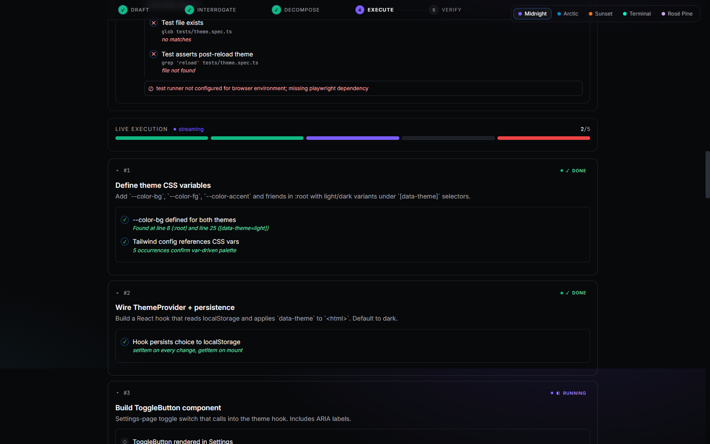
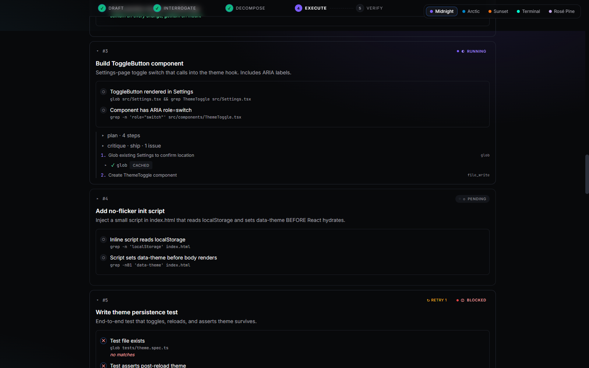
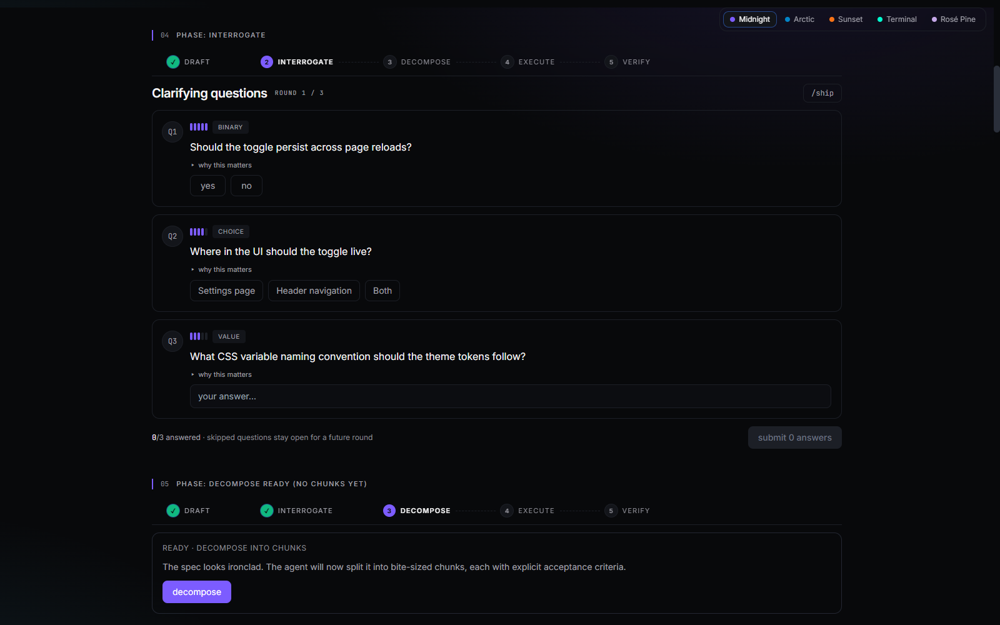
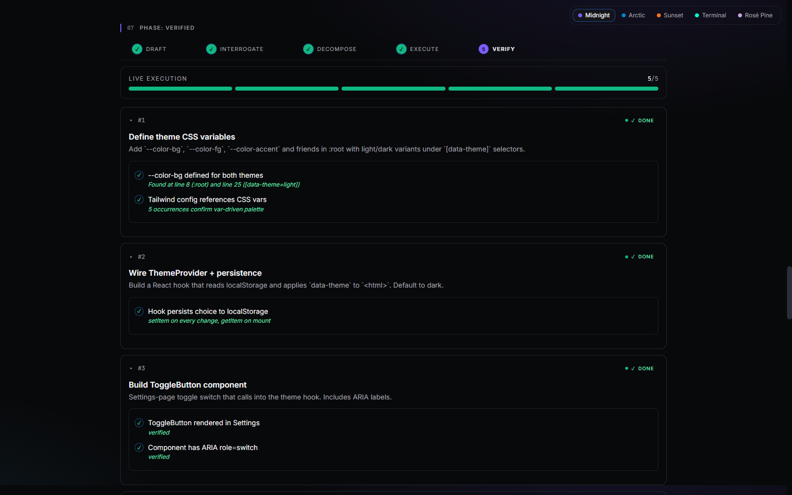
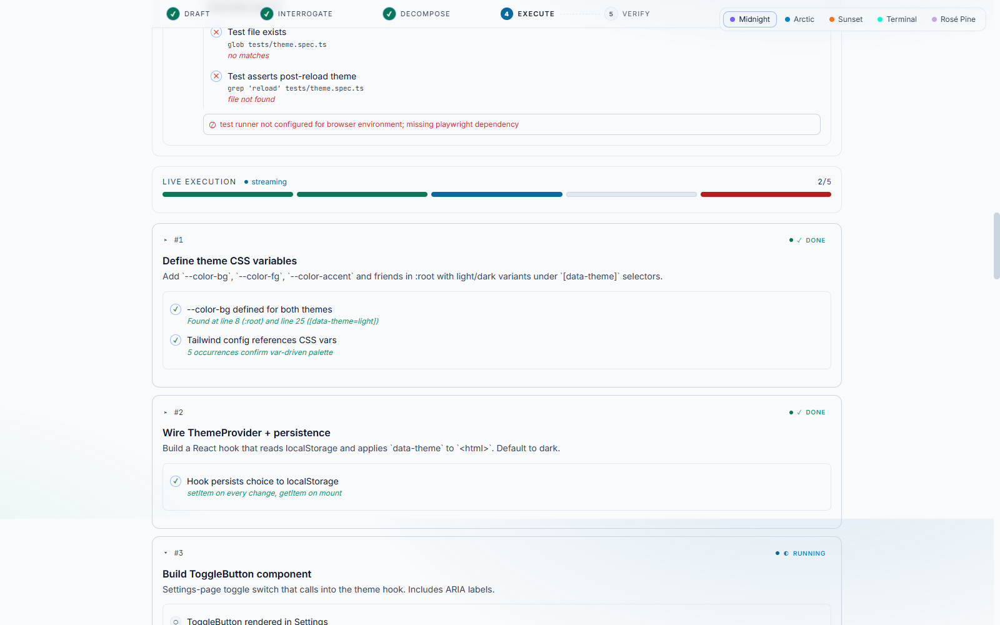
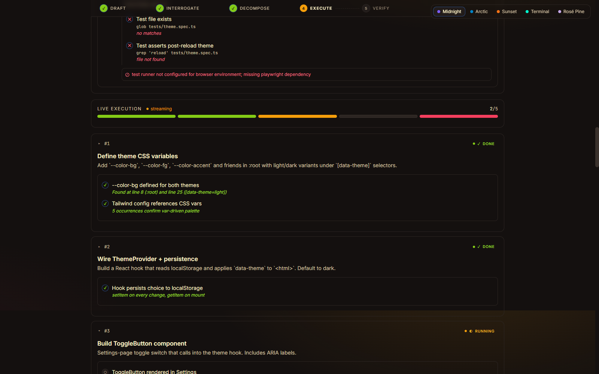
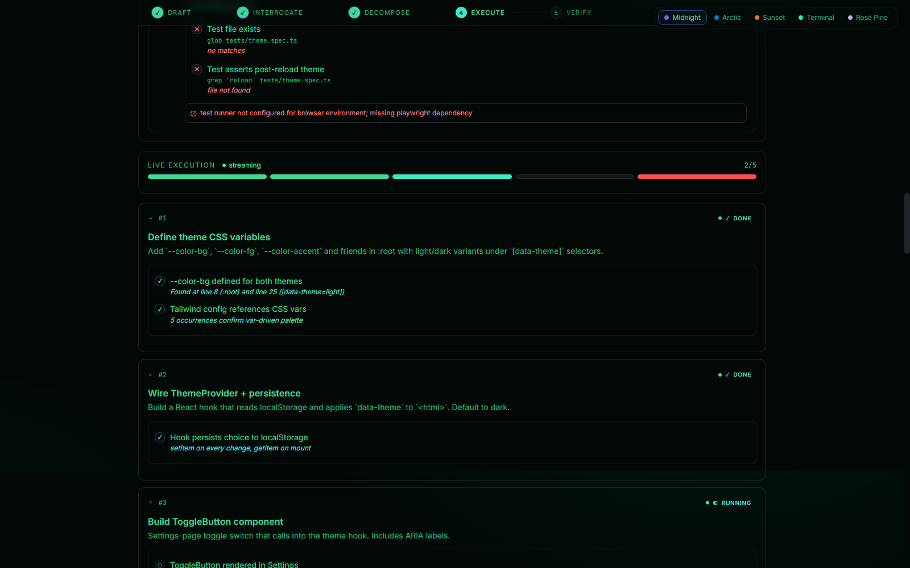
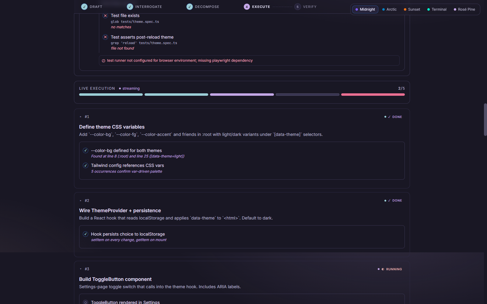

<div align="center">

# 🜲 LocalAgent

### A modular harness for **local LLMs** — chat, agentic tool-use, and
### spec-driven development, all running on your own machine.

[](https://www.python.org/)
[](#-development)
[](#-themes)
[](https://ollama.com)
[](#-license)

**[Installation](#-installation) · [Modes](#-modes-of-operation) · [Themes](#-themes) · [Architecture](#-architecture) · [Tools](#-tool-reference)**

</div>

---



LocalAgent turns a 7B–8B local model into a usable code & research agent.
Three modes share one engine: **streaming chat**, an **agentic planner-executor**
with built-in meta-cognition, and a full **Spec-Driven Development** workflow
that interrogates you, splits work into bite-sized chunks with explicit
acceptance criteria, executes each, and verifies against the real workspace.

Every panel is observable. Every theme is variable-driven. Nothing leaves your machine.

---

## 📑 Contents

- [Why LocalAgent](#-why-localagent)
- [Quick start](#-quick-start)
- [Modes of operation](#-modes-of-operation)
  - [💬 Chat](#-chat-mode)
  - [🤖 Agent](#-agent-mode-planner-executor--meta-cognition)
  - [📐 Spec-Driven Development](#-spec-driven-development)
- [Themes](#-themes)
- [Installation](#-installation)
- [Configuration](#-configuration)
- [Architecture](#-architecture)
- [Tool reference](#-tool-reference)
- [Strategies & project context](#-strategies--project-context)
- [Memory & RAG](#-memory--rag)
- [Development](#-development)
- [License](#-license)

---

## ✨ Why LocalAgent

| | |
|---|---|
| 🔒 **Fully local** | Default Ollama backend; nothing phones home. Pluggable `Provider` ABC for OpenAI-compatible servers if you want one. |
| 🧠 **Meta-cognitive** | Every agentic run is wrapped with **reframe**, **critique**, and **done-check** passes — the reasoning habits that lift weaker models toward Claude-style discipline. |
| 📐 **Spec-driven mode** | The headline feature. Interrogates you to lock the spec down, decomposes into bite-sized chunks with **explicit acceptance criteria**, executes each, and verifies against the real workspace via `grep` / `glob` / `shell_exec`. |
| 🛠 **First-class tools** | Glob, Grep, Read, Edit, MultiEdit, file_write, shell_exec, python_exec, web_fetch — with a result cache, must-Read-first invariant on Edit, CRLF-safe matching, and lazy schemas. |
| 💾 **Long-term memory** | Auto-extracted significance memories (cosine-deduped) plus on-demand RAG over folders + URLs. |
| 🎨 **5 polished themes** | All driven by CSS variables. Switch at runtime — every component re-themes for free. WCAG-AA validated. |
| 📊 **Observable** | Phase timeline, segmented progress bars, criterion verification with evidence, per-chunk timing chips, retry/blocked indicators. Built so you feel empowered to watch every step. |

---

## 🚀 Quick start

```bash
# 1. Install Ollama → https://ollama.com
ollama pull llama3.1:8b qwen2.5-coder:7b llama3.2:1b nomic-embed-text

# 2. Install LocalAgent
git clone https://github.com/DaisyQuest/LocalAgentHarness.git
cd LocalAgentHarness
uv sync                         # or: pip install -e .

# 3. Build the web UI (optional, for the React frontend)
cd web && npm install && npm run build && cd ..

# 4. Run it
uv run localagent serve         # FastAPI server + web UI on http://127.0.0.1:8000
# or
uv run localagent chat          # CLI chat
# or
uv run localagent spec start "Add a dark mode toggle"   # spec-driven mode
```

---

## 🎯 Modes of operation

LocalAgent ships three modes that share one `Engine`. Pick the smallest tool that fits.

### 💬 Chat mode

Streaming chat with **router-classified model selection** (a 1B model picks
`chat`/`code`/`fast` per turn), automatic conversation persistence, optional
**RAG** retrieval, and **long-term memory** auto-recalled from past chats.

```bash
localagent chat                       # auto-routed
localagent chat --role code           # force the code model
localagent chat --rag                 # inject top-k RAG hits per turn
localagent chat --cid <id>            # resume a saved conversation
```

> Type `/remember <text>` mid-conversation to pin a fact. Type `/exit` to leave.

---

### 🤖 Agent mode (planner-executor + meta-cognition)

A two-pass agent with built-in cognitive guardrails. Each run flows through:

```
reframe ─→ plan ─→ critique ─(revise)─→ execute steps ─→ done-check ─→ synthesize
```

| Pass | What it does | Why it matters |
|---|---|---|
| **reframe** | Restates the goal, lists assumptions, scores ambiguity 1–5. If ≥4, asks a clarifying question instead of guessing. | Stops the "build first, ask later" failure mode of small models. |
| **plan** | Decomposes goal into 1–N concrete steps over the tool catalog (compact form by default; full schemas via `tool_search`). | Keeps the planner under-budget on 8k–32k context models. |
| **critique** | Independent reviewer flags missing verification, scope creep, wrong-tool choices. One revision budget for HIGH-severity issues. | Catches "no probe step before mutate" bugs at planning time. |
| **execute** | Runs each step. Tools include Glob/Grep/Read/Edit/MultiEdit/file_write/shell_exec/python_exec/web_fetch with a workspace-keyed LRU cache. | Real work, real safety — Edit refuses to touch a file you haven't `read` first. |
| **done-check** | Per-criterion verification. Forces the synthesizer to admit gaps. | "Verified=true" only if evidence supports it. |
| **synthesize** | Streams the final answer, branching on the done-check verdict. | Honest reports, not confabulated ones. |

```bash
localagent agent run "Find the dead code in src/utils and remove it"
localagent agent run "Refactor X" --yes        # auto-approve risky tools
```

Stream events show up live in CLI / TUI / web. Each `step_start`, `step`,
`critique`, `done_check`, `todos`, and `token` event renders as its own card.

---

### 📐 Spec-Driven Development

The headline feature. Six phases. Real verification. Always observable.



```
draft ──→ interrogate ──→ decompose ──→ execute ──→ verify
   │           │              │           │           │
goal →     ranked Q&A,    bite-sized  per-chunk    real grep
spec       3 rounds max   chunks +    plan +       + glob +
draft      + /ship        acceptance  verify       shell
                          criteria
```

#### 1. **Draft** — your goal becomes a structured spec
Title · summary · requirements · constraints · out-of-scope. The agent does this in one LLM pass.

#### 2. **Interrogate** — ranked clarifying questions
**No vague open-ended prompts**. Every question is one of:
- 🔘 **binary** (yes/no segmented control)
- 🔵 **choice** (radio chips with 2–5 options)
- 📝 **value** (concrete identifier, filename, copy text)

…ranked by importance 1–5. You can answer, skip, or type `/ship` to lock it. Hard cap at 3 rounds.



#### 3. **Decompose** — bite-sized chunks with acceptance criteria
Each chunk gets explicit pass/fail conditions WITH a prescribed verification method:
```
✓ "--color-bg defined in :root"   → grep -n '--color-bg' src/index.css
✓ "ToggleButton renders"          → glob 'src/**/ToggleButton.{tsx,jsx}'
✓ "tests pass"                    → shell_exec: pytest tests/test_theme.py -q
```

#### 4. **Execute** — sequential, with live observability
Every chunk runs through the planner-executor. The UI shows:

- **Segmented progress bar** — one cell per chunk, color-coded by status
- **Numbered status atom** — circle is the chunk number AND status badge (✓/⊘/●)
- **Per-chunk elapsed time** — `4.2s`, `8.8s`, `18s`
- **Cached/retry/blocked chips** make hidden state visible
- **Acceptance criteria headline** — the deliverable, not buried in logs

#### 5. **Verify** — real evidence, not theatre
Every acceptance criterion is **actually checked** against your workspace. The verifier parses your `verification` string into a real tool call (grep/glob/read/shell), gathers evidence, and a small fast model (`llama3.2:1b` by default) judges met/not-met.



#### 6. **Resumable** — `Ctrl-C` is never catastrophic
Every phase transition + every chunk completion persists to `~/.localagent/specs/<id>.json`. Resume any time.

```bash
localagent spec start "Add dark mode toggle"   # full interactive flow
localagent spec resume <id>                    # pick up where you left off
localagent spec list                           # all saved specs
localagent spec show <id>                      # inspect a saved spec
```

Or do everything from the **web UI** at `http://127.0.0.1:8000` after `localagent serve`.

---

## 🎨 Themes

Five themes, all CSS-variable-driven. Switch at runtime; every component re-themes automatically. WCAG AA validated.

| Theme | Look | |
|---|---|---|
| **Midnight** | violet on near-black · the default |  |
| **Arctic** | sky-blue on slate · light theme |  |
| **Sunset** | amber on warm-charcoal |  |
| **Terminal** | phosphor green-on-black |  |
| **Rosé Pine** | iris on byzantium |  |

Add your own by appending a `:root[data-theme="..."]` block to [`web/src/styles.css`](web/src/styles.css) — every component will pick it up.

---

## 📦 Installation

### Requirements

- **Python 3.11+**
- **[Ollama](https://ollama.com)** running locally (or any OpenAI-compatible server — see [Configuration](#-configuration))
- **Node 18+** (only if you want to build the React web UI)
- **GPU recommended** — defaults are tuned for ≥12 GB VRAM (e.g., RTX 4070 Ti Super); CPU-only works but slowly

### Steps

```bash
# 1. Pull the default models
ollama pull llama3.1:8b           # chat / planner
ollama pull qwen2.5-coder:7b      # code / executor
ollama pull llama3.2:1b           # router / verifier (small + fast)
ollama pull nomic-embed-text      # embeddings for memory + RAG

# 2. Clone + install
git clone https://github.com/DaisyQuest/LocalAgentHarness.git
cd LocalAgentHarness
uv sync                           # uses pyproject.toml; or: pip install -e .

# 3. (optional) Build the web UI
cd web && npm install && npm run build && cd ..

# 4. Verify
uv run pytest                     # 65 tests pass without LLM
uv run localagent info            # shows resolved settings
```

### First run

```bash
uv run localagent serve           # http://127.0.0.1:8000 (web + API)
# in another terminal:
uv run localagent chat            # try a quick chat
```

---

## ⚙️ Configuration

Settings live at `~/.localagent/settings.local.json` and are layered over `.env` and defaults. **Hot-reloadable** via the web UI's Settings panel — no restart needed for most fields.

### Environment overrides

```bash
# .env
LOCALAGENT_PROVIDER__BASE_URL=http://localhost:11434
LOCALAGENT_MODELS__CHAT=llama3.1:8b
LOCALAGENT_MODELS__CODE=qwen2.5-coder:7b
LOCALAGENT_TOOLS__ALLOW_SHELL=false       # gated by default
LOCALAGENT_TOOLS__ALLOW_PYTHON_EXEC=false
LOCALAGENT_AGENT__USE_REFRAME=true
LOCALAGENT_AGENT__USE_CRITIQUE=true
LOCALAGENT_AGENT__USE_DONE_CHECK=true
```

### Switching providers

The default is Ollama. To use any OpenAI-compatible endpoint (vLLM, LM Studio, llama.cpp server, etc.):

```bash
LOCALAGENT_PROVIDER__KIND=openai_compat
LOCALAGENT_PROVIDER__BASE_URL=http://localhost:8080/v1
LOCALAGENT_PROVIDER__API_KEY=sk-anything
```

---

## 🏗 Architecture

```
┌──────────────────────────────────────────────────────────────────┐
│                         Surfaces                                  │
│   CLI (typer)   ·   FastAPI server   ·   Textual TUI   ·   Web   │
└────────────────────────────┬─────────────────────────────────────┘
                             │
                  ┌──────────▼──────────┐
                  │       Engine         │  one orchestrator,
                  │  (engine.py)         │  shared by all surfaces
                  └──┬───┬───┬───┬───┬──┘
                     │   │   │   │   │
       ┌─────────────┘   │   │   │   └────────────┐
       │                 │   │   │                 │
┌──────▼────┐   ┌────────▼┐ ┌▼─────┐    ┌─────────▼────────────┐
│  Provider │   │ Storage │ │Memory│    │   Agent System       │
│           │   │         │ │      │    │  ┌────────────────┐  │
│  Ollama   │   │ SQLite  │ │SQLite│    │  │ PlannerExecutor│  │
│  OpenAI-  │   │  conv + │ │ +vec │    │  │  + meta-       │  │
│  compat   │   │ telemtry│ │      │    │  │   cognition    │  │
└───────────┘   └─────────┘ └──────┘    │  └────────────────┘  │
                                         │  ┌────────────────┐  │
       ┌─────────────────────────────────┤  │SpecDrivenAgent │  │
       │                                 │  │ (6 phases +    │  │
┌──────▼─────┐  ┌───────────┐  ┌──────┐  │  │  resumable)    │  │
│   Tools    │  │Strategies │  │ RAG  │  │  └────────────────┘  │
│            │  │ + project │  │      │  └──────────────────────┘
│  Glob Grep │  │  context  │  │ vec  │
│  Read Edit │  │           │  │store │
│  MultiEdit │  │ scoped    │  │      │
│  shell_exec│  │ master    │  │chunk │
│  py_exec   │  │ context   │  │HTML/ │
│  web_fetch │  │ injection │  │MD/PDF│
│  + cache   │  └───────────┘  └──────┘
└────────────┘
```

### Key invariants
- **`Engine` is the single source of truth** — every surface (CLI, web, TUI, API) routes through it.
- **`Provider` ABC** keeps Ollama swappable for any OpenAI-compatible server.
- **Tool registry** carries session state (must-Read-first stamps), an LRU result cache, and confirm-gating.
- **Strategies** are markdown-with-frontmatter master-context blocks injected per scope (`chat` / `planner` / `executor` / `synthesizer`).
- **Project context** auto-loads from `LOCALAGENT.md` / `AGENTS.md` walking up from the workspace.

---

## 🛠 Tool reference

All tools live in [`src/localagent/tools/`](src/localagent/tools/) and route through one registry with workspace boundaries, session state, and a result cache.

### 🔍 Search
| Tool | What it does |
|---|---|
| `glob(pattern, path?, head_limit?)` | Find files by glob (supports `**`). Pure Python, no shell. Sorted by mtime. |
| `grep(pattern, path?, glob?, output_mode?, ...)` | Search file contents with regex. Modes: `content` / `files_with_matches` / `count`. Multiline + context lines. |

### 📄 File ops
| Tool | What it does |
|---|---|
| `read(path, offset?, limit?)` | Read with `cat -n` line numbers. Stamps a "you've read this" marker for `edit`. |
| `edit(path, old_string, new_string, replace_all?)` | Precise patch. **Requires prior `read` of the same file.** Refuses non-unique matches. CRLF-safe. Returns unified diff. |
| `multi_edit(path, edits[])` | Sequential batch edits. All-or-nothing — any failure aborts. |
| `file_write(path, content, append?)` | Full overwrite (returns diff vs prior content). |

### ⚙️ Exec (gated by default)
| Tool | What it does |
|---|---|
| `shell_exec(command, cwd?)` | Run a shell command. Disabled until `tools.allow_shell=true`. Workspace-bounded. |
| `python_exec(code)` | Isolated subprocess. Disabled until `tools.allow_python_exec=true`. |

### 🌐 Web
| Tool | What it does |
|---|---|
| `web_fetch(url, max_bytes?)` | GET a URL, strip HTML, return text. |

### 🧰 Meta
| Tool | What it does |
|---|---|
| `tool_search(query)` | Look up full JSON schemas on demand (lazy schema pattern — saves tokens on small models). |

---

## 📚 Strategies & project context

**Strategies** are scoped master-context blocks injected into agent system prompts. They live as plain markdown at `~/.localagent/strategies/<slug>.md` so you can hand-edit them.

```yaml
---
name: Verify Before Claim
description: Don't assert facts without checking. Prefer cheap probes.
scopes: [planner, executor, chat]
active: true
---

Before asserting a file exists, a symbol is defined, or memory recall is current,
do the cheapest possible verification first.
- File path? Check it exists before reading.
- Function name? grep before referencing.
- Memory says X? Confirm X is still true now — memories can be stale.
…
```

**Seed strategies (active by default):**
- `verify-before-claim` — prefer cheap probes
- `scope-discipline` — match action to ask
- `name-the-conflict` — surface evidence/reasoning conflicts
- `stop-when-done` — know when to stop
- `spec-mode-discipline` — stay inside the chunk during spec runs

```bash
localagent strategy list
localagent strategy show verify-before-claim
localagent strategy edit                       # opens the folder
localagent strategy activate <id>
```

**Project context** — drop a `LOCALAGENT.md` (or `AGENTS.md`) at any ancestor of the workspace. The strategy store walks up from the workspace root and includes the first one it finds in every scope. Like Claude Code's `CLAUDE.md`.

---

## 💾 Memory & RAG

### Long-term memory
Background extractor pulls "significance" memories from each conversation every N turns, embeds them, dedupes against existing memories (cosine threshold), and stores them in a `sqlite-vec` (or pgvector) backend. Auto-recalled on every chat turn.

```bash
localagent memory add "I prefer Tailwind over CSS-in-JS" --kind preference
localagent memory list
localagent memory search "css framework"
localagent memory forget <id>
```

### RAG
Ingest folders, files, or URLs. Chunked, embedded, and queried with cosine similarity. Inject top-k hits per chat turn with `--rag`.

```bash
localagent rag ingest ~/projects/docs/
localagent rag ingest https://example.com/spec.html
localagent rag list
localagent rag search "deployment process"
```

---

## 🧪 Development

```bash
# Install dev deps
uv sync --group dev

# Run tests (no LLM required — 65 unit + integration tests)
uv run pytest -q

# Type check
uv run mypy src/

# Lint
uv run ruff check src/

# Web UI dev mode (HMR)
cd web && npm run dev          # http://localhost:5173

# Web UI production build
cd web && npm run build        # output to web/dist
```

### Visual regression / design review
The web UI ships a built-in showcase route that renders every spec UI state with mock data. After building, visit:

```
http://127.0.0.1:8000/?showcase=spec
```

Toggle themes from the floating picker. Useful for design review and screenshot diffing.

---

## 📜 License

[MIT](LICENSE) — do whatever you want with it.

---

## 🙏 Acknowledgments

- **[Ollama](https://ollama.com)** — the local-LLM runtime that makes this possible
- **[Anthropic](https://anthropic.com)** — for the design patterns this harness borrows from Claude Code (lazy tool schemas, must-Read-first edits, project-context auto-loading)
- **[sqlite-vec](https://github.com/asg017/sqlite-vec)** — embedded vector search without the operational burden
- **[Tailwind](https://tailwindcss.com)**, **[React](https://react.dev)**, **[FastAPI](https://fastapi.tiangolo.com)**, **[Typer](https://typer.tiangolo.com)**, **[Textual](https://textual.textualize.io)** — the frontend + backend toolkit

---

<div align="center">

**Built to be local. Built to be observable. Built to ship.**

</div>
